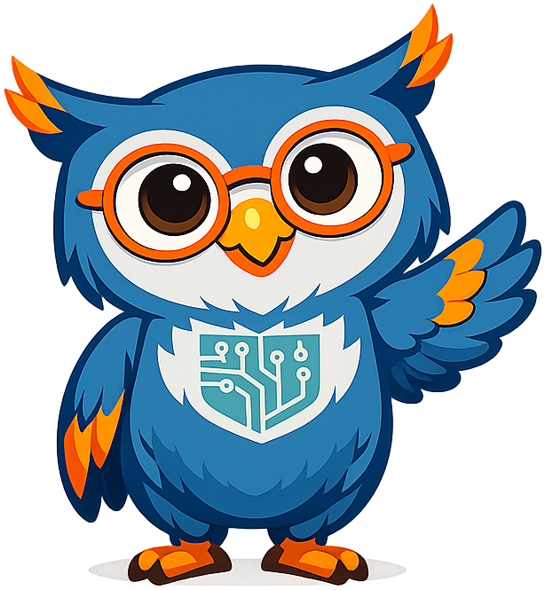
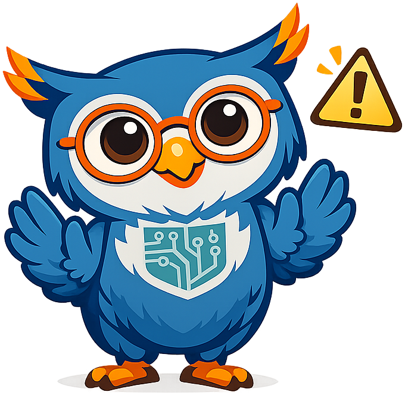

# Building Your AI Strategy

## Summary

Establishes the strategy vocabulary and decision-making frameworks that underpin everything that follows: strategic planning, knowledge organisations, digital transformation, the Generative AI Center of Excellence model, return on investment, use-case identification, build-versus-buy, vendor selection, and executive sponsorship. Readers leave with the conceptual toolkit to frame AI decisions as strategic choices rather than technology purchases.

## Concepts Covered

This chapter covers the following 15 concepts from the learning graph:

1. AI Strategy
2. Knowledge Organization
3. Strategic Planning
4. Digital Transformation
5. Center Of Excellence
6. Return On Investment
7. Use Case Identification
8. Build Versus Buy
9. Vendor Selection
10. Total Cost Of Ownership
11. Strategic Urgency
12. Competitive Advantage
13. Innovation Culture
14. Stakeholder Alignment
15. Executive Sponsorship

## Prerequisites

This chapter builds on concepts from:

- [Chapter 1: AI Foundations — What Every Educator Needs to Know](../01-ai-foundations/index.md)
- [Chapter 2: Measuring the AI Capability Curve](../02-ai-capability-curve/index.md)

---

!!! mascot-welcome "Welcome to Chapter 3"
    { class="mascot-admonition-img" }
    You have the data; now you need the vocabulary and the frameworks. This chapter gives you both — the conceptual toolkit for making AI decisions as a strategist, not as a technology buyer. *"Think ahead — act now."*

## From Technology Decision to Strategic Choice

Most institutions approach AI the wrong way: they start with a tool and ask "how can we use this?" Strategy works in the opposite direction — start with the mission, identify where capability gaps hurt outcomes most, then ask "what tools and structures will close those gaps?" This inversion is what separates institutions that stumble through AI adoption from ones that build lasting capability.

An **AI strategy** is a documented, decision-making framework that defines how an institution will use artificial intelligence to advance its mission, manage its risks, and adapt as the technology changes. It is not a list of tools to purchase. It is not a one-time project. It is an ongoing governance posture — a set of repeatable processes for gathering ideas, evaluating them, resourcing the best ones, and learning from results. The chapters that follow build every piece of that posture; this chapter names the components and explains why each matters.

## What Kind of Organization Are You?

Before a school or university can build an effective AI strategy, its leaders need to understand what kind of institution they are managing — specifically, how it creates and manages knowledge. A **knowledge organization** is any institution whose primary product is not a physical good but organized information, expertise, and skill. Schools, universities, libraries, think tanks, and professional associations are all knowledge organizations. What they produce — curricula, degrees, research, professional development — is ultimately a structured form of human understanding.

This matters for AI strategy because AI fundamentally changes the economics of knowledge work. When an AI model can draft a lesson plan, summarize a research paper, generate a personalized explanation of a concept, or answer a parent's question at 11 p.m., it is doing work that was previously reserved for trained human professionals. Understanding your institution as a knowledge organization — and mapping where its knowledge work happens and at what cost — is the foundation of AI use-case identification.

## Strategic Planning in an Exponential Era

**Strategic planning** in most educational institutions follows an annual cycle: survey stakeholders in the fall, draft goals in the winter, set budgets in the spring, execute over the summer, and repeat. This cycle was designed for a world in which the operating environment changes slowly enough that a 12-month plan remains approximately valid for most of its duration. As Chapter 2 established, AI capability is doubling every four to seven months — which means the operating environment changes significantly within the span of a single annual planning cycle.

The answer is not to abandon multi-year planning, but to build **strategic urgency** into the planning structure. Strategic urgency means explicitly acknowledging that delay has a cost — that waiting 18 months to begin governance work means 18 months during which AI is being adopted by students and staff without institutional oversight, and during which the capability gap between what AI can do and what the institution is organized to use continues to widen. The institutions that build competitive advantage from AI will not be the ones that moved fastest recklessly; they will be the ones that built durable governance structures soonest.

The following table outlines the components of a complete AI strategy document — the kind of document this course will help every participant draft for their own institution.

| Component | What It Contains | Where Covered |
|-----------|-----------------|---------------|
| Mission alignment | How AI serves the institution's educational mission | Chapters 3, 13 |
| Use-case portfolio | Prioritized list of AI applications under evaluation | Chapters 5, 6 |
| Risk register | Identified risks, likelihood, severity, and mitigations | Chapters 9, 10 |
| Governance structure | Decision-making authority, review cadence, policies | Chapter 11 |
| Resource plan | Budget, staffing, and timeline commitments | Chapter 6 |
| Data and privacy plan | xAPI/LRS data governance, FERPA compliance | Chapters 7, 9 |
| Roadmap | Phased timeline of initiatives with milestones | Chapter 13 |
| SWOT analysis | Strengths, weaknesses, opportunities, threats | Chapter 13 |

## Digital Transformation — What It Actually Means

The phrase **digital transformation** appears in virtually every technology strategy document in education, and has been diluted almost to meaninglessness by overuse. For the purposes of this course, it has a specific meaning: digital transformation is the process of redesigning organizational workflows and value delivery around the capabilities of digital tools — rather than simply using digital tools to do old workflows faster.

Buying iPads and handing them to students who still follow a traditional lecture-and-test curriculum is digitization, not transformation. Redesigning the school day so that AI-tutored personalized learning in the morning frees teachers for mentorship and project facilitation in the afternoon — as in the Alpha School model — is transformation. The distinction matters because digitization produces incremental efficiency gains while transformation can produce structural changes in what outcomes the institution achieves and at what cost.

AI strategy should be explicit about which kind of change is being pursued in each initiative. Some initiatives — automating administrative paperwork, drafting first-cut lesson plans for teacher review — are digitization plays with real value. Others — personalizing every student's learning path, restructuring the school day — are transformation plays that require change management, community engagement, and multi-year commitment. Conflating the two leads to unrealistic timelines for transformation projects and missed opportunities for quick digitization wins.

!!! mascot-thinking "Sage thinks about transformation"
    { class="mascot-admonition-img" }
    Ask this question for every AI initiative your institution considers: "Are we using AI to do the old thing faster, or to do a fundamentally different thing?" The answer determines the timeline, the stakeholders you need, and the success metrics you should set.

## The Center of Excellence Model

The **Center of Excellence** (CoE) is an organizational structure that has emerged as the most effective model for managing AI adoption in large, complex institutions. A CoE is a small, cross-functional team — typically 3 to 8 people in a school district or university — that owns four responsibilities:

- **Expertise:** Maintaining current knowledge of what AI can and cannot do, so that operational staff and administrators do not each have to become AI experts.
- **Standards:** Setting the policies, evaluation criteria, and data-governance rules that every AI project must follow.
- **Pipeline management:** Running the idea funnel — collecting, evaluating, prioritizing, and resourcing AI projects from across the institution.
- **Enablement:** Providing training, templates, shared code repositories, and implementation support so that individual departments can execute AI projects without reinventing the wheel.

The CoE model is adapted from the **Generative AI Center of Excellence** structure developed in enterprise settings and refined for education by practitioners who recognized that educational institutions face the same coordination problems — many departments each doing AI separately, no shared standards, duplicated vendor contracts, uneven risk management — as large corporations.

#### Diagram: Center of Excellence Organizational Structure

Interactive organizational chart showing CoE structure and relationships

Type: chart
**sim-id:** coe-org-chart 
**Library:** vis-network 
**Status:** Specified

**Learning objective:** Understanding (Bloom's) — readers identify the role of each CoE function and how it relates to the broader institution.

**Canvas:** Responsive, full container width, 420px height.

**Nodes (clickable, each opens an infobox):**
- Central node: "AI Center of Excellence" (large, deep orange #E65100) — Infobox: "The CoE is a small cross-functional team that owns AI strategy, standards, pipeline management, and enablement for the entire institution."
- "Expertise & Research" (steelblue) — Infobox: "Tracks AI capability developments, evaluates vendor claims, and maintains the institution's AI knowledge base."
- "Standards & Policy" (steelblue) — Infobox: "Defines the policies, evaluation rubrics, and data-governance rules that every AI project must meet."
- "Idea Funnel" (steelblue) — Infobox: "Runs the idea-gathering, registry, and evaluation process. Feeds prioritized projects to the resourcing pipeline."
- "Enablement & Training" (steelblue) — Infobox: "Provides professional development, shared tools, templates, and implementation support to operational units."
- Outer ring (gray): "Curriculum", "IT", "Finance", "Instruction", "HR", "Families" — each with infobox: "An operational unit that submits ideas to the funnel, follows CoE standards, and receives enablement support."

**Edges:**
- CoE → each outer node: labeled "Standards & Support", bidirectional.
- CoE → Idea Funnel: labeled "Pipeline", directed.

**Layout:** Hierarchical, CoE centered, four function nodes in middle ring, operational units in outer ring.

**Responsive:** Resizes with container via fit() on window resize.

## Return on Investment — Defining Value in Education

**Return on investment** (ROI) is a financial concept that, in its purest form, compares the financial gain from an investment against its cost: ROI = (Gain − Cost) / Cost. In for-profit settings, gain means revenue. In education, gain is more nuanced — it includes student learning outcomes, teacher satisfaction and retention, administrative efficiency, equity of access, and community trust.

Defining ROI for education AI requires choosing which gains to count. Before starting any AI initiative, a school or district should answer three questions:

- **What outcome are we trying to improve?** (Reading proficiency, parent response time, teacher planning hours, graduation rate.)
- **How will we measure it before and after?** (The baseline and the metric.)
- **What does a meaningful improvement look like, and is the expected improvement worth the cost and risk?**

Without those three answers documented up front, it is impossible to evaluate whether an AI initiative succeeded. Many school districts have purchased AI tutoring tools, deployed them widely, and found a year later that they had no data to judge whether student outcomes improved — because they never defined the baseline or the success metric before launch.

## Use-Case Identification

**Use-case identification** is the process of systematically finding the applications of AI that offer the highest value for a specific institution at a specific point in time. Not all AI applications are equally valuable for every school. A small rural district with a stretched administrative staff may get enormous value from AI tools that automate attendance reporting, communicate with families, and summarize IEP meeting notes. A large urban district with a diverse student population may prioritize AI tutoring and early-alert systems for at-risk students.

The idea funnel — covered in depth in Chapter 5 — is the primary tool for use-case identification in this course. But before the funnel can work, leaders need a map of the landscape: what kinds of problems does AI commonly solve in education settings?

Four broad categories organize most education AI use cases:

- **Instruction enhancement:** AI tutors, adaptive content, personalized practice, intelligent textbooks.
- **Teacher support:** Lesson planning, grading assistance, differentiation suggestions, professional development.
- **Administration:** Attendance, scheduling, parent communication, reporting, procurement analysis.
- **Student support:** Early-alert systems, counseling support, college and career advising, attendance intervention.

Within each category, some applications are mature (deployed successfully in multiple districts), some are emerging (demonstrated in pilots but not yet at scale), and some are speculative (technically feasible but not yet reliably beneficial). Use-case identification means mapping your institution's highest-priority problems against this landscape and starting with the intersection of "high priority" and "mature."

## Build Versus Buy

Every AI initiative eventually faces the **build-versus-buy** decision: should the institution procure an existing AI tool from a vendor, or build a custom solution? In education, the default answer is almost always to buy rather than build — educational institutions are not technology companies, and maintaining custom software is expensive, risky, and distracting from the mission. But "buy" covers a wide spectrum from purchasing a packaged product to subscribing to an AI API and building a lightweight wrapper around it, and the decision deserves a clear framework.

Before examining the framework, it helps to understand the three main options:

1. **Purchase a packaged product:** Buy an AI tutoring platform, an AI writing assistant, or an AI scheduling tool from a vendor. Low build cost; high dependence on vendor's roadmap and pricing.
2. **Configure a platform:** Use a general-purpose AI platform (like a major LLM provider's API) with minimal custom code. Moderate cost; more flexibility; requires some technical staff.
3. **Build custom:** Develop a solution from scratch or fine-tune an AI model for a specific need. High cost; maximum control; high maintenance burden.

#### Diagram: Build vs. Buy Decision Framework

Interactive decision flowchart for build-versus-buy evaluation

Type: chart
**sim-id:** build-vs-buy-framework 
**Library:** vis-network 
**Status:** Specified

**Learning objective:** Applying (Bloom's) — readers trace a decision path for a specific AI use case through the framework and arrive at a justified recommendation.

**Canvas:** Responsive, full container width, 480px height.

**Nodes (each clickable with infobox):**
- Start: "New AI Use Case" (gray oval).
- Decision 1: "Does a mature packaged product exist?" (diamond, orange) — Infobox: "Search vendor landscape first. A mature product means 3+ school-district deployments with published outcomes data."
- Decision 2: "Can vendor meet data/privacy requirements?" (diamond, orange) — Infobox: "FERPA, COPPA, state privacy laws, and district data agreements must all be satisfied before any student data enters a vendor system."
- Decision 3: "Is the use case highly institution-specific?" (diamond, orange) — Infobox: "If your use case requires knowledge of your specific curriculum, community, or workflow that no vendor has, custom becomes more justifiable."
- Outcome A: "Buy: Packaged Product" (green box) — Infobox: "Lowest implementation cost. Focus effort on procurement, onboarding, and outcome measurement."
- Outcome B: "Buy: API + Light Configuration" (teal box) — Infobox: "Good for use cases where packaged products exist but don't meet privacy requirements. Requires technical staff or a partner."
- Outcome C: "Build: Custom Solution" (steelblue box) — Infobox: "Reserve for genuinely unique needs. Document the total cost of ownership before committing — custom solutions are far more expensive to maintain than to build."
- Outcome D: "Revisit in 6–12 Months" (gray box) — Infobox: "If no mature product exists and the use case is not institution-specific enough to justify custom build, wait. The vendor market moves fast."

**Directed edges:**
- Start → Decision 1
- Decision 1 → "Yes" → Decision 2
- Decision 1 → "No" → Decision 3
- Decision 2 → "Yes" → Outcome A
- Decision 2 → "No" → Outcome B
- Decision 3 → "Yes" → Outcome C
- Decision 3 → "No" → Outcome D

**Layout:** Top-to-bottom hierarchy.
**Responsive:** Resizes with container via fit() on window resize.

## Vendor Selection and Total Cost of Ownership

When the build-versus-buy analysis points toward purchasing, **vendor selection** is the next critical step. Selecting an AI vendor in education requires evaluating dimensions that traditional procurement checklists often miss. Before examining those dimensions, it helps to have a clear picture of what "cost" actually includes — which brings us to **total cost of ownership** (TCO).

Total cost of ownership is the complete cost of an AI system over its full lifecycle — not just the purchase price or subscription fee, but every cost associated with deploying and maintaining it. TCO for an education AI tool typically includes:

- **Licensing or subscription fees** (the quoted price)
- **Implementation costs** — staff time, consulting, integration with existing systems
- **Training costs** — professional development, onboarding, change management
- **Ongoing maintenance** — system updates, troubleshooting, vendor support contracts
- **Data governance costs** — privacy reviews, compliance audits, parent consent management
- **Replacement costs** — what it will cost to switch vendors when the contract ends or the product is discontinued

A common mistake in education procurement is comparing only licensing fees across vendors, ignoring TCO. A less expensive tool with a steep implementation curve and poor vendor support can easily cost more over three years than a pricier tool with excellent onboarding and a stable feature set.

!!! mascot-warning "Watch Out for Hidden TCO"
    { class="mascot-admonition-img" }
    When comparing AI vendors, ask each one: "What does a typical district of our size spend in the first year beyond the license fee?" If they can't answer specifically, budget a 50–100% implementation-cost premium on top of the license fee and see if the investment still makes sense.

## Strategic Urgency and Competitive Advantage

**Strategic urgency** — the recognition that delay has a measurable cost — is not the same as recklessness. It is the acknowledgment that in an exponentially improving technological environment, the institutions that build durable governance structures soonest will have the longest runway to adapt and iterate. Those that wait for the "right time" — when AI is more mature, when the research is clearer, when budgets are easier — may find themselves years behind on both capability and governance.

In education, **competitive advantage** does not mean beating other schools in a market (though charter schools and private institutions do compete for enrollment). It means delivering outcomes for students that are measurably better than what the institution could achieve with its current approach. A district that successfully deploys AI-driven early-alert systems will identify at-risk students months earlier than it otherwise would. A university that builds a robust xAPI data infrastructure will be ready to offer AI-personalized learning plans when those tools become widely available. These are genuine, measurable advantages — for students.

**Innovation culture** is the organizational posture that makes sustained competitive advantage possible. An innovation culture is not a culture of recklessness or novelty for its own sake; it is a culture in which staff feel safe submitting ideas, leaders act on evidence rather than tradition, and failures are analyzed for lessons rather than hidden. The idea funnel, introduced in Chapter 5, is the operational structure that turns innovation culture from a slogan into a process.

## Stakeholder Alignment and Executive Sponsorship

Even the most technically sound AI strategy will fail without two prerequisites: **stakeholder alignment** and **executive sponsorship**. These are not soft considerations to address after the strategy is written — they are prerequisites that must be built during strategy development.

**Stakeholder alignment** means that the key groups who will be affected by an AI initiative — teachers, students, families, IT staff, department heads, unions, the school board — have been consulted, have had their concerns taken seriously, and understand the reasoning behind decisions. Alignment does not require unanimous enthusiasm. It requires that stakeholders feel heard, that their concerns have shaped the strategy (not just been noted and dismissed), and that they have a clear channel for ongoing feedback.

**Executive sponsorship** means that a senior leader — a superintendent, provost, principal, or board chair — is personally and publicly committed to the AI strategy, willing to remove organizational obstacles, and accountable for its outcomes. Without executive sponsorship, AI initiatives stall when they hit resistance from middle management or when budget cycles tighten. The executive sponsor is not the person who does the technical work; they are the person who ensures the organization makes space for that work to happen.

#### Diagram: Stakeholder Alignment Map

Interactive stakeholder map showing alignment, influence, and concerns for an AI strategy

Type: chart
**sim-id:** stakeholder-alignment-map 
**Library:** vis-network 
**Status:** Specified

**Learning objective:** Analyzing (Bloom's) — readers identify each stakeholder group's role in AI strategy adoption, their typical concerns, and the engagement strategies that build alignment.

**Canvas:** Responsive, full container width, 440px height.

**Central node:** "AI Strategy" (large, deep orange #E65100).

**Stakeholder nodes (each clickable with infobox):**
- "Superintendent / Provost" (steelblue, large) — Infobox: "Executive sponsor. Must publicly champion the strategy, allocate budget, and remove obstacles. Primary concern: board and community trust."
- "School Board / Trustees" (steelblue, large) — Infobox: "Governance body. Approves policy and budget. Primary concern: student safety, equity, and fiscal responsibility."
- "Teachers / Faculty" (teal) — Infobox: "Front-line adopters. Must find AI tools genuinely helpful, not threatening. Primary concern: role displacement, workload, and academic integrity."
- "Students" (teal) — Infobox: "Primary beneficiaries. Active voices in equity and access concerns. Primary concern: privacy, fairness, and whether AI tools help them learn."
- "Families & Parents" (teal) — Infobox: "Community stakeholders. Strong influence on board and community trust. Primary concern: data privacy, screen time, and equity."
- "IT & Data Staff" (gray) — Infobox: "Implementation enablers. Must integrate AI tools with existing systems securely. Primary concern: security, support burden, and technical debt."
- "HR & Unions" (gray) — Infobox: "Workforce stakeholders. Concerned about role changes and workload implications. Primary concern: job security and working conditions."

**Edges:**
- All stakeholder nodes connected to "AI Strategy" center.
- Edge weight reflects influence: Superintendent and Board have heavier edges; IT and HR have thinner edges.
- Edge label shows engagement mode: "Sponsor", "Approve", "Adopt", "Consult", "Implement", "Negotiate".

**Interaction:**
- Clicking a stakeholder node opens its infobox.
- Hovering an edge shows the engagement-mode label prominently.

**Layout:** Concentric rings — central node, then inner ring (executive, board), outer ring (others). Force-directed with fixed center.
**Responsive:** fit() on window resize.

## Putting It Together — The Strategy Framework

An AI strategy is not a document you write once and file. It is a governance operating system that your institution runs continuously. The framework this course teaches has five structural elements that must all be in place for the strategy to be durable:

- **An idea funnel** — the repeatable process for gathering, evaluating, and selecting AI initiatives (Chapters 5 and 6).
- **A governance structure** — the policies, decision authorities, and review cadences that ensure consistent standards (Chapter 11).
- **A risk register** — the documented risks, likelihood and severity assessments, and mitigation plans for every active initiative (Chapters 9 and 10).
- **An xAPI/LRS data architecture** — the technical infrastructure that makes AI-personalized learning measurable and accountable (Chapter 7).
- **A SWOT-based strategic roadmap** — the synthesis document that a board can read, approve, and hold leadership accountable to (Chapter 13).

This course builds each of these elements in sequence. By the final chapter, every participant will have the components needed to assemble a complete, board-ready AI strategy document for their own institution.

!!! mascot-celebration "Sage Celebrates Your Progress"
    { class="mascot-admonition-img" }
    You now have the vocabulary to speak about AI as a strategist — not a technology buyer. Strategy, digital transformation, CoE, TCO, stakeholder alignment — these terms give you the precision to frame decisions, evaluate trade-offs, and bring your community along. The next chapters build the machinery. *"Strategy without action is just a plan."*

## Key Takeaways

- An **AI strategy** is a documented governance posture — a set of repeatable processes — not a list of tools to purchase.
- **Knowledge organizations** (schools, universities) are especially affected by AI because AI directly changes the economics of knowledge work.
- **Digital transformation** means redesigning workflows around AI capability, not just using AI to do old workflows faster.
- The **Center of Excellence** model gives a small cross-functional team ownership of expertise, standards, pipeline management, and enablement.
- **Return on investment** in education requires defining the outcome metric and baseline before launch, not after.
- **Use-case identification** starts with mapping the institution's highest-priority problems against mature AI applications.
- The **build-versus-buy** decision should default to "buy" in education, with custom solutions reserved for genuinely institution-specific needs.
- **Total cost of ownership** includes implementation, training, maintenance, data governance, and replacement — not just the license fee.
- **Strategic urgency** and **competitive advantage** in education mean delivering better student outcomes faster, not winning a market race.
- **Stakeholder alignment** and **executive sponsorship** are prerequisites to strategy success, not afterthoughts.
