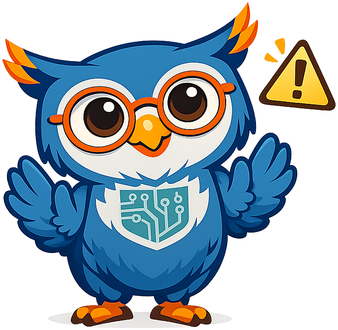

# Explaining AI with Storytelling

## Summary

Strategy without communication is just a document in a drawer. This chapter equips education leaders with the skills to make AI concepts land with any audience — school boards, parents, teachers, community members, and students. Drawing on Alan Alda's landmark book *If I Understood You, Would I Have This Look on My Face?* and the science of human communication, the chapter covers empathy-first communication, Theory of Mind, active listening, the neuroscience of connection (mirror neurons), the "flame" metaphor for igniting understanding, improv principles, narrative arc, analogies and metaphors for AI, audience analysis, stakeholder-specific messaging, fear-to-curiosity reframing, and the surprising power of vulnerability and authentic communication.

## Concepts Covered

This chapter covers the following 15 concepts from the learning graph:

1. Science Communication
2. Empathy-First Communication
3. Theory of Mind
4. Active Listening
5. The Flame Metaphor
6. Improv Principles for Communication
7. Narrative Arc
8. Analogies and Metaphors for AI
9. Audience Analysis
10. Fear-to-Curiosity Reframing
11. Stakeholder-Specific Messaging
12. Mirror Neurons and Emotional Connection
13. Common AI Misconceptions
14. Vulnerability and Authentic Communication
15. The "Yes, And" Principle

## Prerequisites

This chapter builds on concepts from:

- [Chapter 1: AI Foundations — What Every Educator Needs to Know](../01-ai-foundations/index.md)
- [Chapter 3: Building Your AI Strategy](../03-ai-strategy-foundations/index.md)
- [Chapter 11: AI Governance, Policy, and Change Management](../11-governance-policy/index.md)

---

!!! mascot-welcome "Welcome to Chapter 14"
    { class="mascot-admonition-img" }
    You have built the strategy. You understand the capability curve. You know the risks and the rewards. Now comes the hardest part: explaining all of it to people who are worried, skeptical, excited for the wrong reasons, or simply confused. In this chapter we learn how to communicate AI not just clearly, but *memorably*. *"Let's chart the course!"*

## Why Clarity Is Not Enough

Education leaders who have attended AI conferences and read the research often return with a clear picture of what artificial intelligence can do, what it cannot do, what the risks are, and what the strategic opportunity looks like. They sit down with a parent advisory committee, a school board, or a skeptical department chair and explain all of it — clearly, accurately, and in good faith. And the audience walks away more confused, more anxious, or more dismissive than when they entered.

Clarity is necessary but not sufficient. The failure is not a lack of information. It is a failure of *connection*.

This is the central insight of Alan Alda's book *If I Understood You, Would I Have This Look on My Face?* — a book that emerged from Alda's decades of experience as a science communicator, his work hosting *Scientific American Frontiers*, and his founding of the Alan Alda Center for Communicating Science at Stony Brook University. The title is the joke version of the book's core argument: if you truly understood what I was explaining, you would not have the blank, confused, or alarmed look on your face right now.

Alda's proposition is that the problem is almost never the complexity of the subject matter. Scientists explaining quantum mechanics can be understood. Teachers explaining machine learning can be understood. Administrators explaining AI policy can be understood. The problem is that the *communicator* has stopped paying attention to the *listener* — has stopped checking whether the flame of understanding has been lit, or has merely been broadcasting information at a person.

**Science communication** is the discipline of translating expert knowledge into forms accessible to non-expert audiences without distorting the core truth. For education leaders, the subject matter is AI strategy, and the non-expert audiences are the communities they serve. The principles of science communication apply directly.

## Empathy First, Information Second

The most important rule in Alda's framework is so counterintuitive that it bears stating twice: **connect before you explain**.

**Empathy-first communication** means beginning with genuine curiosity about what your audience already believes, what they are worried about, what they hope for, and what they fear before you say a single word about AI. Not a perfunctory "does anyone have questions?" at the end. A genuine, investigative, open-ended conversation at the beginning: *What have you heard about AI in schools? What feels exciting? What keeps you up at night?*

This is counterintuitive for experts because experts are usually asked to explain things. Explaining feels like the job. But Alda points out that explanation without connection produces the experience of being talked at — a fundamentally unreceptive state in which the listener's brain is occupied with evaluating, defending, or simply enduring rather than genuinely receiving.

When the communicator begins by listening rather than explaining, something different happens. The audience member feels heard. Their defenses lower. They become, for the first time, genuinely curious about what the expert thinks — because the expert has just demonstrated they are genuinely curious about what the audience thinks. This is the psychological precondition for real communication.

For AI communication specifically, empathy-first means acknowledging the fear before explaining the opportunity. A parent who is worried that AI will make their child dependent and lazy is not ready to hear about personalized learning plans. They are ready to have their worry taken seriously, explored, and addressed. The moment you skip over the worry to get to the upside, you lose them.

!!! mascot-thinking "Sage thinks about empathy-first communication"
    { class="mascot-admonition-img" }
    The most common mistake education leaders make when presenting AI strategy is spending 80% of their preparation time on the content of the presentation and 0% thinking about what the audience already believes about AI. Try flipping that ratio. Know your audience before you build your slides.

## Theory of Mind — Seeing Through Your Audience's Eyes

Alan Alda identifies **Theory of Mind** — the cognitive ability to model another person's beliefs, knowledge, and perspective as distinct from your own — as the single most important communication skill and the one most consistently ignored by technical experts.

Theory of Mind is what allows you to recognize that the school board member sitting in front of you does not share your mental model of how a large language model works, has probably read three alarming newspaper headlines about AI in the past week, and is currently evaluating your presentation through the lens of "will this hurt or help the children in my community?" — not through the lens of "what are the architectural trade-offs between fine-tuning and retrieval-augmented generation?"

When Theory of Mind fails, the expert explains what *they* find interesting or important rather than what *the listener* needs to understand first. The result is a talk that is accurate, comprehensive, and completely inaccessible — not because the audience is incapable of understanding, but because the speaker never paused to consider what the audience was bringing into the room.

The practical application of Theory of Mind before an AI presentation is simple: ask yourself three questions before you design a single slide.

1. **What does this audience already believe about AI?** Not what you wish they believed — what they actually believe, based on what they have read, heard, and experienced.

2. **What is this audience afraid will happen?** Not whether their fears are rational — what they are. Fear is a real psychological state that must be addressed, not wished away.

3. **What outcome does this audience care about?** A school board cares about community trust, legal exposure, and student outcomes. A parent cares about their specific child's learning, safety, and future. A teacher cares about their professional role and workload. These are different audiences requiring different presentations of the same strategy.

## Active Listening — The Skill You Are Not Using

Alda is emphatic that most people believe they are listening when they are actually waiting to speak. **Active listening** — genuine, attentive, curious listening in which the listener is fully present to what the speaker is saying rather than formulating their response — is rare and powerful.

In AI communication contexts, active listening matters most in the question-and-answer exchange, the informal conversation before the presentation begins, and the one-on-one follow-up. These are the moments when the audience reveals what they actually think — and when a communicator who is truly listening can catch a misunderstanding before it becomes a fixed belief, address a fear before it becomes opposition, or discover a concern that the prepared presentation never anticipated.

Active listening is also a relationship-building act. When an audience member asks a worried question and the communicator listens without interrupting, paraphrases the concern before answering, and takes the worry seriously rather than dismissing it, that audience member walks away feeling respected. Respect is the precondition for trust. Trust is the precondition for change.

The failure mode is what Alda calls "listening to respond" — processing the beginning of what someone says, mentally drafting a reply, and then waiting for them to stop talking so you can deliver it. This produces technically responsive answers that miss the emotional content entirely — and the emotional content is usually where the real concern lives.

## Mirror Neurons — The Neuroscience of Connection

Alda draws on neuroscience research on **mirror neurons** to explain why human connection is not just a soft skill but a biological substrate of communication. Mirror neurons are neural circuits that activate both when you perform an action and when you observe someone else performing it — they are the mechanism by which we "feel" what we observe in others.

The communication implication is direct: when a speaker is genuinely engaged, curious, and emotionally present, the audience's mirror neuron systems resonate with that state. The speaker's enthusiasm becomes, in a very literal neurological sense, partially the audience's enthusiasm. Conversely, when a speaker is reading from slides with low energy, the audience's mirror systems generate a state of low engagement.

For AI communicators, this means that *how* you feel about the material in the room matters almost as much as *what* you say about it. A leader who has genuinely wrestled with the tension between AI's risks and rewards, who finds the capability curve both exciting and sobering, who holds the equity concerns as real and important — that leader's authentic engagement will land differently than the same words delivered by someone going through the motions.

This is also why the performance of enthusiasm is ineffective. Audiences are exquisitely sensitive to the difference between real engagement and performed engagement — mirror neurons respond to genuine states, not staged ones. The communicator who has not done the work of honestly reckoning with AI's complexity will be difficult to trust, even if they cannot articulate exactly why.

## The Flame Metaphor — Lighting Understanding, Not Filling a Vessel

Alda uses a striking metaphor for what genuine communication feels like: lighting a flame in another person's mind. When communication succeeds, the listener's understanding ignites — they experience that characteristic feeling of a concept suddenly making sense, of pieces clicking into place, of seeing something they could not see before. That moment of ignition is the goal of communication.

**The flame metaphor** contrasts with the more common implicit model of communication as filling a vessel — pouring information into a container that was previously empty. The vessel metaphor fails because it treats the listener as passive and empty, which they are not. Listeners arrive full: full of existing beliefs, emotional states, prior knowledge, misconceptions, fears, hopes, and experiences. Information poured into a mind full of incorrect beliefs does not displace those beliefs — it sits on top of them, or gets filtered through them, or simply does not stick.

The flame metaphor requires the communicator to find what is already burning in the audience's mind — the curiosity, the concern, the prior experience — and light the new understanding from that existing flame. This is why AI presentations that lead with a compelling story, a specific student, a concrete classroom scene, or a visceral question consistently outperform presentations that lead with a definition of machine learning. The story lights the flame. The definition pours water.

Practically, the flame metaphor means asking before every major concept: *What do my audience members already care about or already know that can serve as the spark for this idea?* A school board member who has watched their district's reading scores remain stubbornly flat for a decade has an existing flame of frustration. That flame can ignite understanding of why personalized, mastery-based AI tutoring represents a genuinely new approach — not because you explained mastery-based learning, but because you connected it to something that already mattered.

!!! mascot-tip "Sage's Tip on the Flame Metaphor"
    { class="mascot-admonition-img" }
    Before your next AI presentation, write down three things your audience already cares about deeply — not AI things, human things: their children's futures, their teachers' wellbeing, their community's competitive position. Build your presentation so each AI concept gets lit from one of those existing flames.

## Improv Principles for AI Communicators

Alda trained for years with improvisational theater ensembles in developing the Alda Center's curriculum, and he argues that improv is the best existing training ground for the real-time responsiveness that communication requires. **Improv principles for communication** are not about being funny or unprepared — they are about being genuinely present, collaborative, and responsive in the moment.

The most famous improv principle is **"Yes, And"** — the practice of accepting whatever your scene partner offers (yes) and adding to it rather than blocking or redirecting (and). In communication terms, "Yes, And" means receiving what your audience offers — a worry, a question, a misunderstanding, an objection — as a genuine contribution rather than an obstacle, and building on it rather than arguing against it.

A parent who says "AI will replace teachers" is not raising an objection to be defeated. They are offering a worry that contains something real — the fear that human connection and professional expertise are being devalued. "Yes, And" means acknowledging the real thing in the worry: *"Yes, that fear makes complete sense given how AI is being discussed in the media, and what we're actually seeing in practice is that teachers in AI-augmented classrooms report spending more time on the mentorship and relationship work they went into teaching to do — which is the part that can't be automated."* The "yes" honors the worry. The "and" redirects toward a more accurate picture.

Other improv principles that Alda applies to communication:

- **Be present**: Stop mentally preparing your next point while your audience is still talking. Your audience can tell when you are not listening.
- **Make your partner look good**: In a presentation context, this means framing difficult questions as valuable rather than inconvenient. The questioner who challenges your AI strategy in a board meeting is helping you find the weaknesses before they become problems.
- **Accept offers**: When an audience member draws an unexpected connection — "this reminds me of when we introduced calculators" — treat it as a gift rather than a digression. It is the audience telling you what flame exists in their mind.

## Narrative Arc — Structure That Makes Complexity Manageable

The **narrative arc** is the basic structure of a story: a protagonist faces a challenge, struggles against it, and is transformed. Every meaningful story humans tell follows some version of this structure — from fairy tales to documentary films to case studies in business school. The reason is not convention but cognition: the human brain is wired to track cause-and-effect sequences centered on a character's goal-directed struggle. We understand and remember things more deeply when they arrive as story.

For AI communication, the narrative arc is a tool for making abstract technical concepts concrete and memorable. The abstract concept "AI can provide personalized learning at scale" becomes story when it has a protagonist (a specific student, a specific teacher, a specific school), a challenge (third grade math gaps that whole-class instruction cannot address), a struggle (the resource constraints, the skeptical parents, the teacher who had to learn new tools), and a transformation (the student who finally grasped fractions, the teacher who now spends her afternoons mentoring instead of grading).

Stories with specific names, specific settings, and specific stakes are more persuasive and more memorable than data for a simple reason: the brain processes a story as a partial simulation of the events described. The listener does not just receive information — they partially experience the story. That partial experience creates emotional resonance, and emotional resonance drives memory and belief in ways that bullet points cannot.

The application for AI strategy presentations is clear: every major claim your strategy makes should be anchored to a specific story. Not "AI tutoring improves outcomes" but "Maria's school in Phoenix piloted a two-hour AI-tutored morning block, and their reading proficiency scores increased from 51% to 68% over a single academic year — here is what that actually looked like for Maria's third-graders." The data matters. The story makes the data land.

#### Diagram: Technology Adoption Curve

<iframe src="../../sims/shared/technology-adoption/main.html" width="100%" height="520" scrolling="no"></iframe>
[Run Technology Adoption Curve Fullscreen](../../sims/shared/technology-adoption/main.html)

## Analogies and Metaphors — Making AI Concepts Land

**Analogies and metaphors for AI** are the most practical communication tools available to education leaders, because the concepts underlying AI are genuinely unfamiliar to most audiences and explanation alone — no matter how clear — rarely produces understanding. A well-chosen analogy does in thirty seconds what a five-minute technical explanation cannot.

The challenge is that most available AI metaphors are wrong in ways that create the misconceptions education leaders spend their careers fighting.

| Misconception-producing metaphor | Why it misleads | Better alternative |
|----------------------------------|----------------|--------------------|
| "AI thinks like a human brain" | Implies consciousness, emotion, intent | "AI recognizes patterns in data the way autocomplete recognizes patterns in your typing — at enormous scale" |
| "AI will replace teachers" | Implies AI has the relational and emotional capacity of a teacher | "AI handles the practice and feedback that calculators handle for math — it frees teachers for the human work that matters most" |
| "AI knows everything" | Implies infallibility, creates over-reliance | "AI is like a very well-read research assistant who sometimes confidently misremembers — you should always check important claims" |
| "AI is a black box no one understands" | Produces fatalism and helplessness | "We understand what AI was trained on and what it was optimized for — what we're still learning is all the edge cases, just as we learned the edge cases of the internet over time" |

Good analogies for AI in education draw on things the audience already understands:

- **The calculator analogy**: AI does for language and reasoning what the calculator did for arithmetic — augments human capability without replacing the human who decides what to calculate and what to do with the result.
- **The GPS analogy**: GPS did not eliminate the need for drivers or the professional skill of navigating — it changed what those skills look like. An education leader who knows their community, their students, and their values is not replaceable by an AI that knows curricula and test scores.
- **The medical diagnosis analogy**: AI diagnostic tools in medicine do not replace physicians — they give physicians better data faster, allowing doctors to spend more time on the clinical judgment and patient relationship that require human presence. The same division of labor applies in education.

!!! mascot-warning "Sage's Warning on AI Analogies"
    { class="mascot-admonition-img" }
    The worst AI analogy is a science-fiction one. The moment you compare an AI tutoring system to HAL 9000, Skynet, or a robot teacher, you have activated every dystopian narrative in your audience's imagination. AI movies are designed to be frightening. Real AI in classrooms is designed to be useful. Make sure your analogies come from your audience's real experience, not the movies.

## Audience Analysis — Know Who Is in the Room

**Audience analysis** is the practice of systematically understanding your audience before designing your communication — their existing knowledge, their concerns, their stakes, their decision-making role, and their communication preferences. It is the practical implementation of Theory of Mind at scale.

For education leaders communicating AI strategy, four primary audiences have meaningfully different starting points and communication needs:

**School board members** are fiduciaries whose primary concern is institutional risk and community accountability. They need to understand: What could go wrong? What is our legal exposure? What will the community say? They respond to risk/reward framing, case studies from comparable institutions, clear governance structures, and evidence that leadership has thought about failure modes. They are suspicious of hype and responsive to measured, data-grounded optimism.

**Teachers** are practitioners whose primary concern is their professional role and daily workload. They need to understand: Will this make my job harder or easier? Will it replace me? Will I have to learn an entirely new set of tools? Do the people making this decision understand what my classroom actually looks like? They are skeptical of top-down mandates and responsive to the voices of peers who have piloted AI tools, to concrete demonstrations of time saved, and to explicit assurances about their professional role.

**Parents** are advocates whose primary concern is their specific child's wellbeing and future. They need to understand: Is this safe? Will my child become dependent on AI? Will this prepare my child for college and career? Is my child's data being protected? They respond to specific, concrete stories about how AI helps children learn, to clear explanations of privacy protections, and to evidence that teachers remain central to their child's education.

**Students** are the primary beneficiaries whose primary concern is whether this is interesting, fair, and relevant to their lives. They need to understand: Will this be used to surveil me? Does it actually help me learn, or is it just another worksheet? Will I get credit for my own thinking if AI helped? They respond to autonomy, to genuine participation in decisions that affect them, and to demonstrations that AI tools are genuinely useful rather than imposed.

## Fear-to-Curiosity Reframing

The most powerful communication move available to AI strategists is **fear-to-curiosity reframing** — the practice of receiving an audience member's fear as a genuine signal worth investigating together, rather than an obstacle to overcome.

Fear about AI in education is widespread, understandable, and, in many cases, pointing at real things. Parents who fear AI will make children lazy are pointing at something real about over-reliance and skill atrophy (covered in Chapter 9). Teachers who fear AI will eliminate their profession are pointing at something real about the economic disruption that automation historically produces. Board members who fear AI will expose the district to lawsuits are pointing at something real about data privacy and algorithmic bias.

The instinct of the AI advocate is to correct these fears — to explain why they are overblown, poorly calibrated, or based on misunderstanding. This approach, however understandable, almost always fails. Correcting a fear without first honoring it signals that you do not take the person seriously, which produces defensiveness rather than openness.

Reframing means receiving the fear, naming what is real in it, and redirecting toward the question together: *"That fear about teacher replacement is one I take seriously, and I want to share some data with you about what has actually happened in schools that have deployed these tools — and then I want to hear what you think, because the teachers in our community are the experts on their own professional experience."*

The reframe has three components:

1. **Honor the fear**: Acknowledge it as real, understandable, and worth taking seriously.
2. **Name what is true in it**: Every significant fear about AI contains a genuine concern. Naming it demonstrates that you have done the honest thinking.
3. **Redirect to curiosity**: Transform "what if AI does terrible thing X" into "let's find out together what the evidence says about X and what we can do about it."

## Stakeholder-Specific Messaging

**Stakeholder-specific messaging** is the practice of designing different versions of the same core message for different audiences — not changing what is true, but changing which aspects of the truth are most relevant to each audience's concerns and decision-making role.

Your district's AI strategy might have twenty components. A school board needs to understand the governance and risk dimensions well and the technical architecture not at all. A teacher professional development session needs to engage deeply with what changes in daily classroom practice. A parent information night needs to focus on student experience and privacy protections. A student assembly needs to address academic integrity and how AI tools can genuinely help.

The discipline is not spin — it is relevance. Audiences tune out information that does not connect to what they care about, not because they are incapable of understanding it but because the human brain is a finite-attention device that ruthlessly prioritizes what matters now. The AI strategist who speaks to a parent concern at a parent meeting is not hiding the board-level governance details — they are making choices about what will actually land in the time available.

A useful planning framework for stakeholder-specific messaging is the **message triangle**:

1. **What do you want them to know?** (one key fact or concept)
2. **What do you want them to feel?** (one emotional state — confidence, curiosity, reassurance)
3. **What do you want them to do?** (one concrete action — support the pilot, enroll their child, attend the workshop)

Every stakeholder communication should have clear answers to all three. If you do not know what you want the audience to do, you have not yet finished designing the communication.

!!! mascot-thinking "Sage thinks about stakeholder messaging"
    { class="mascot-admonition-img" }
    The school board meeting is not the right venue for the technical architecture diagram. The parent information night is not the right venue for the risk register. Know your audience, know what they need to walk out believing and feeling, and design your communication around those outcomes — not around everything you know.

## Common AI Misconceptions and How to Address Them

An important component of Theory of Mind for AI communicators is knowing the **common AI misconceptions** your audience is likely to hold before they walk into the room, so you can address them directly rather than inadvertently reinforcing them.

The following misconceptions are consistently identified in public surveys about AI in education:

**"AI understands what it is saying."** Most people assume that AI produces intelligent-sounding text because it comprehends the content. In reality, large language models predict which words are most likely to follow other words based on patterns in training data. The result can sound remarkably like understanding — and can be remarkably useful — without involving comprehension in any sense a human would recognize. This misconception drives both over-reliance ("the AI must be right, it sounds so confident") and excessive anthropomorphization.

**"AI is objective and free from bias."** AI systems inherit the biases present in their training data, which reflects the biases present in the humans who created that data and the societies that shaped it. An AI tutoring system trained predominantly on content from well-resourced schools will perform differently with students from under-resourced communities. Algorithmic bias in education is not theoretical — it is a documented, active concern (addressed in depth in Chapter 9).

**"AI knows everything about my child."** Privacy anxiety in parents often rests on an assumption that AI systems are pooling and analyzing all data about specific students across all contexts. In well-designed, privacy-compliant systems, the learning telemetry from Chapter 7 operates within strict FERPA and COPPA constraints, data is aggregated rather than individually surveilled, and students own their learning records. Explaining what the data actually looks like and how it is actually used — concretely, specifically, without jargon — is essential for building parent trust.

**"AI will make our students stop thinking."** The skill atrophy concern is real and worth taking seriously (Chapter 9 covers it directly), but the misconception is the assumption that AI inevitably produces passivity. A well-designed AI tutor uses Socratic questioning rather than answer-giving (Chapter 8), requires students to articulate their reasoning, and specifically targets the development of the higher-order thinking skills that AI cannot replace. The design of the AI tool matters enormously — and education leaders can make better choices when they understand this.

## Vulnerability and Authentic Communication

The final insight from Alda's framework — and perhaps the most counterintuitive for institutional leaders — is the power of **vulnerability and authentic communication**: the willingness to say "I don't know," to acknowledge genuine uncertainty, and to communicate from a place of honest inquiry rather than performed authority.

Leaders who feel they must appear to have all the answers about AI before they can speak publicly about it will never speak publicly about it, because no one has all the answers. AI capability is changing fast enough that any claim to comprehensive certainty is suspect. The leaders who communicate most effectively about AI are those who can hold the honest tension: "AI represents the most significant capability shift in education in a generation, and we do not yet have all the answers about how to implement it well — and that is exactly why we are engaging our community in this conversation now rather than after all the decisions have been made."

This kind of authentic uncertainty is not a weakness. It is, paradoxically, a trust-building move. Research on credibility consistently shows that communicators who acknowledge the limits of their knowledge are rated as more trustworthy than those who project comprehensive confidence — because audiences know that no one knows everything, and a communicator who never admits uncertainty is implicitly claiming otherwise.

For AI communication specifically, authentic uncertainty also models the epistemic attitude that education leaders want to cultivate in their communities: the willingness to engage with difficult questions without requiring premature resolution, to hold complexity without collapsing it into false simplicity, and to remain curious rather than defensive when challenged.

!!! mascot-encourage "Sage on the Courage to Not Know"
    { class="mascot-admonition-img" }
    If someone in your community asks a question about AI that you cannot answer, saying "I don't know — and here is how we will find out together" is more credible than saying something that sounds confident but is wrong. The leaders who build the most durable community trust around AI are the ones who demonstrate honest inquiry, not flawless expertise.

## Putting It Together — The AI Conversation Framework

Drawing all the principles in this chapter together, education leaders can use the following five-step framework for designing any AI communication, from a five-minute conversation at a school board meeting to a forty-five-minute community presentation.

**Step 1 — Audience Analysis.** Before designing any content, answer: Who is this audience? What do they already believe about AI? What are they afraid of? What do they care about most? What is the one thing I want them to walk away believing, feeling, and doing?

**Step 2 — Lead with empathy.** Open not with your content but with their concerns. Ask what they have heard, what they are worried about, what they hope for. Listen actively. Do not move to Step 3 until the audience feels heard.

**Step 3 — Light from an existing flame.** Find the connection between what they already care about and the concept you need to explain. Use that connection as your starting point. Choose analogies drawn from their experience, not yours.

**Step 4 — Tell the story before you state the principle.** Every major claim should arrive as a story first — a specific person, a specific situation, a specific challenge and its resolution — before being stated as an abstract principle. Stories light the flame. Abstractions assume it is already burning.

**Step 5 — Stay present and "Yes, And."** The Q&A, the informal conversation, the challenge from the skeptic in the front row — these are the most important moments of the communication. Stay genuinely curious. Receive objections as contributions. Let the audience see that you are interested in what they think, not just in delivering what you prepared.

#### Diagram: Technology Hype Cycle

<iframe src="../../sims/shared/hype-cycle/main.html" width="100%" height="520" scrolling="no"></iframe>
[Run Technology Hype Cycle Fullscreen](../../sims/shared/hype-cycle/main.html)

!!! mascot-celebration "Sage Celebrates Your Communication Readiness"
    { class="mascot-admonition-img" }
    You now have both a strategy and a way of talking about it. Alan Alda spent decades learning to light the flame of understanding in his audiences — and the leaders who bring AI into their communities thoughtfully will spend their careers developing the same skill. The strategy in a document is inert. The strategy that lives in the conversations of a community is real. *"Strategy without action is just a plan."*

## Key Takeaways

- **Clarity is not enough**: technical accuracy without human connection produces confusion and anxiety, not understanding or buy-in.
- **Empathy-first communication** means genuinely listening to your audience's concerns before delivering any content — this is the psychological precondition for real communication.
- **Theory of Mind** — modeling your audience's existing beliefs, fears, and goals as distinct from your own — is the most important and most neglected communication skill for technical experts.
- **Active listening** means attending to what your audience is actually saying, including the emotional content, rather than waiting to deliver your prepared response.
- **Mirror neurons** are the biological substrate of connection: your genuine engagement with the material will resonate with your audience in ways that performed enthusiasm will not.
- The **flame metaphor** means finding what your audience already cares about and lighting your new ideas from that existing flame, rather than pouring information into an empty vessel.
- **Improv principles** — especially "Yes, And" — train communicators to be genuinely present and collaborative rather than defensive and scripted.
- **Narrative arc** makes abstract AI concepts concrete and memorable by placing them in the structure of a specific story with a protagonist, a challenge, and a transformation.
- **Analogies and metaphors** are essential tools for AI communication, but wrong analogies — especially science-fiction ones — produce the misconceptions education leaders most need to prevent.
- **Audience analysis** means knowing what each distinct stakeholder group needs to hear, feel, and do — and designing different versions of the same core truth for each.
- **Fear-to-curiosity reframing** honors the genuine concern in an audience's fear before redirecting toward evidence and shared inquiry.
- **Stakeholder-specific messaging** applies the message triangle — what to know, what to feel, what to do — to each distinct community the education leader must bring along.
- **Common AI misconceptions** must be addressed proactively: that AI understands what it says, that it is objective, that it surveils individual students, and that it inevitably produces passivity.
- **Vulnerability and authentic communication** — including saying "I don't know" — builds more durable trust than performed certainty in a rapidly changing field.
