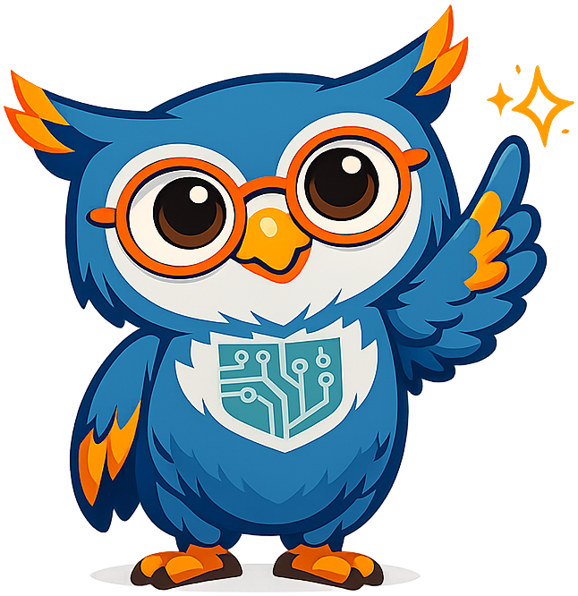

# AI Strategy for Education

<figure markdown>
  { width="100%" }
</figure>

**A free, open-source intelligent textbook for K-12 and higher-education leaders.**

Artificial intelligence is improving on an exponential curve — the length of task a frontier model can complete autonomously has **doubled roughly every four to seven months for six straight years**. This course exists because the gap between what AI can do and what our institutions are organized to use is widening every quarter. It gives education leaders a disciplined, repeatable way to close it.

This is not a coding course and not a hype tour. It is a **strategy course** — built around a single, repeatable decision-making workflow that any school, district, college, or university can run: gather ideas, evaluate them, select a portfolio of projects, assign resources, and measure results. Every opportunity is paired with equal weight on the hazards — privacy, bias, equity, and the risks of moving too fast or too slowly.

---

## Book at a Glance

| | |
|---|---|
| **Chapters** | 13 |
| **Concepts in the Learning Graph** | 221 |
| **Glossary Terms** | 214 |
| **FAQ Questions** | 63 |
| **Chapter Quizzes** | 13 (195 questions total) |
| **Annotated Reference Lists** | 13 |
| **Diagrams and Visual Elements** | 30 |
| **Equivalent Printed Pages** | ~580 |
| **License** | CC BY-NC-SA 4.0 — free to use |

---

## What You Will Learn

This book works through six core capabilities every education institution needs:

1. **Read the capability curve** — interpret the METR task-horizon data and understand why AI capabilities require a different kind of planning than most technology trends.
2. **Run the idea funnel** — systematically gather, evaluate, and select AI projects from teachers, staff, students, and families.
3. **Understand the intelligent-textbook landscape** — what 10,000 AI-tutored textbooks means for procurement, curriculum, and the teacher's role.
4. **Build learning telemetry** — how xAPI, the Learning Record Store, and an AI-driven LMS combine to produce individualized learning plans for every student.
5. **Manage risk and equity** — build a risk register, run a SWOT analysis, and make the case for equitable AI adoption to your board.
6. **Write a board-ready strategy** — the capstone project is a draft AI strategy document ready to present to a school board or board of trustees.

---

## Chapters

| # | Title |
|---|-------|
| 1 | [AI Foundations — What Every Educator Needs to Know](chapters/01-ai-foundations/index.md) |
| 2 | [Measuring the AI Capability Curve](chapters/02-ai-capability-curve/index.md) |
| 3 | [Building Your AI Strategy](chapters/03-ai-strategy-foundations/index.md) |
| 4 | [Generative AI, Intelligent Textbooks, and the Content Revolution](chapters/04-genai-and-intelligent-textbooks/index.md) |
| 5 | [The Idea Funnel — Gathering, Registering, and Evaluating Ideas](chapters/05-idea-funnel-gathering/index.md) |
| 6 | [Selecting Projects, Assigning Resources, and Evaluating Outcomes](chapters/06-selecting-projects/index.md) |
| 7 | [Learning Telemetry, xAPI, and AI-Driven Personalization](chapters/07-learning-telemetry-xapi/index.md) |
| 8 | [New Pedagogical Models — The Alpha School and Beyond](chapters/08-pedagogical-models/index.md) |
| 9 | [Responsible AI — Ethics, Bias, Privacy, and Fairness](chapters/09-responsible-ai/index.md) |
| 10 | [Academic Integrity, Equity, and Managing AI Risk](chapters/10-integrity-equity-risk/index.md) |
| 11 | [AI Governance, Policy, and Change Management](chapters/11-governance-policy/index.md) |
| 12 | [The Agentic AI Workforce in Education](chapters/12-agentic-ai-workforce/index.md) |
| 13 | [Strategic Planning — SWOT, Roadmaps, and the Capstone Strategy](chapters/13-strategic-planning/index.md) |

---

## Supporting Resources

| Resource | Description |
|----------|-------------|
| [Glossary](glossary.md) | 214 plain-language definitions for every key term |
| [FAQ](faq.md) | 63 questions and answers organized by topic |
| [Learning Graph](learning-graph/index.md) | Interactive visualization of 221 concept dependencies |
| [Course Description](course-description.md) | Full course overview, learning outcomes, and Bloom's Taxonomy alignment |
| [About](about.md) | Author bio, motivation, and how to cite this book |

Each chapter also includes:

- A **quiz** (15 questions, collapsed answers) for self-assessment
- An **annotated reference list** (10–13 curated sources) for deeper reading

---

## Who This Book Is For

This textbook was written for **decision-makers and stakeholders across the full education system** — no technical background required. Every term is defined before it is used. If you are any of the following, this book was written for you:

- Superintendent, principal, or curriculum director evaluating AI tools or policies
- Classroom teacher trying to understand how AI will reshape your role
- K-12 school board member voting on AI budgets or policies
- Higher-education provost, dean, CIO, or faculty senate member
- Parent or community member who wants to understand what AI means for your children's school
- Instructional designer or IT staff responsible for implementing AI initiatives

---

## How to Use This Book

Read chapters in order — concepts build on each other, and the learning graph ensures prerequisites are always introduced before they are needed. Use the **search bar** at the top to jump to any term. When you encounter an unfamiliar word, check the [Glossary](glossary.md). When you want to see how a concept connects to the rest of the course, visit the [Learning Graph](learning-graph/index.md).

Each chapter ends with a **quiz** — try to answer without looking, then expand the collapsed answers to check.

---

!!! mascot-tip "Sage's Tip"
    { class="mascot-admonition-img" }
    Start with Chapter 1 to build your vocabulary — every strategy conversation in this book depends on having shared, precise language. If you already work in EdTech and know your LLMs from your LMSs, you can skim Chapter 1 and jump to Chapter 2, where the capability-curve data gets genuinely surprising. *Let's chart the course!*
