# List of MicroSims

MicroSims are small, interactive educational simulations — each one focused on
a single concept. They live under `docs/sims/<sim-name>/` and are embedded
into chapters via iframes.

Many AI/strategy MicroSims are shared with other textbooks (such as
[Tracking AI](https://dmccreary.github.io/tracking-ai-course/)). Those live in
the central
**[shared-microsims](https://github.com/dmccreary/shared-microsims)** repository
and are mounted here as a git submodule at `docs/sims/shared/`. To edit a
shared sim, change it in the `shared-microsims` repo (not inside
`docs/sims/shared/`), then pull the submodule forward.

-   **[AI Benchmarks Timeline](./shared/ai-benchmarks-timeline/index.md)**

    

    Interactive timeline showing key AI benchmarks and when they were introduced.

-   **[AI Capability Maturity Model](./shared/ai-cmm/index.md)**

    

    Interactive visualization of five AI maturity levels from Ad Hoc to Transformative.

-   **[AI Causes of Acceleration](./shared/ai-causes/index.md)**

    

    A causal loop diagram showing how AI feedback is accelerating AI progress.

-   **[AI Concept Hierarchy](./ai-concept-hierarchy/index.md)**

    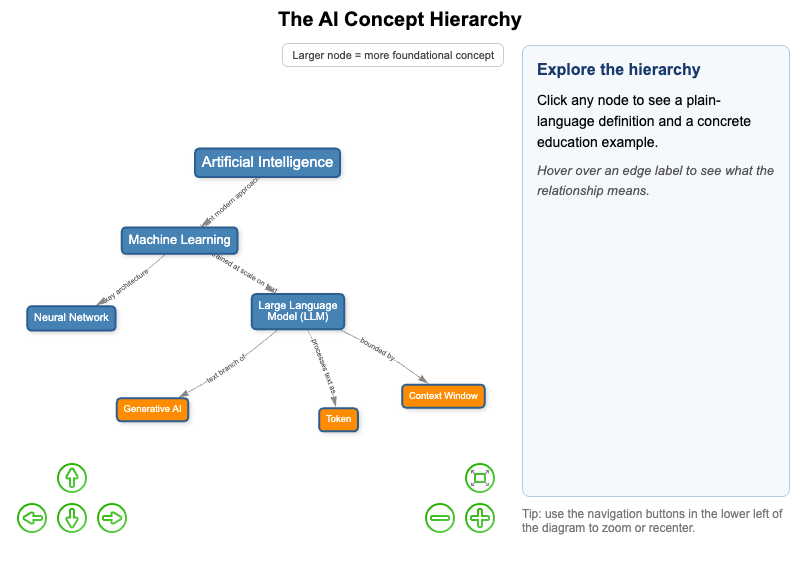

    Interactive vis-network concept map showing how AI, machine learning, neural networks, LLMs, generative AI, tokens, and context windows relate to each other.

-   **[AI Doubling Rate](./shared/ai-doubling-rate/index.md)**

    

    Analysis of AI task completion doubling rate based on METR research.

-   **[AI Flywheel](./shared/ai-flywheel/index.md)**

    

    An infographic MicroSim of the AI Flywheel causal loop.

-   **[AI Governance Structure — Hybrid Model](./ai-governance-structure/index.md)**

    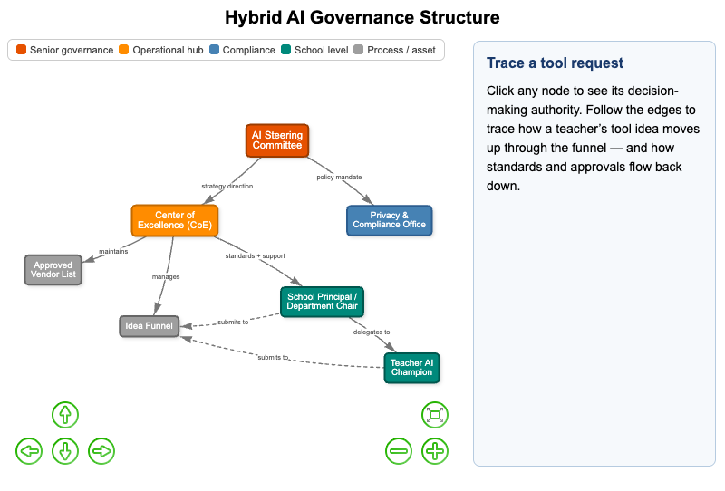

    Interactive vis-network diagram of a hybrid AI governance model showing decision authority at each level and how a tool-adoption request moves through the system.

-   **[AI Pace Accelerating](./shared/ai-pace-accelerating/index.md)**

    

    Interactive visualization demonstrating how AI capabilities are accelerating.

-   **[AI Program Pipeline Report](./pipeline-report-dashboard/index.md)**

    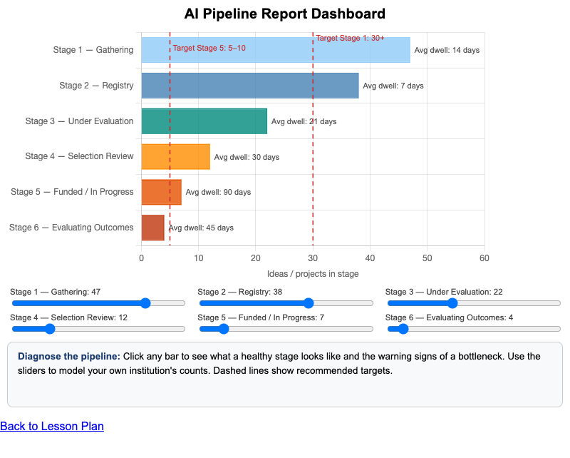

    Interactive Chart.js dashboard for interpreting an AI program pipeline report to spot healthy stages and bottlenecks.

-   **[AI Strategy Implementation Roadmap](./ai-implementation-roadmap/index.md)**

    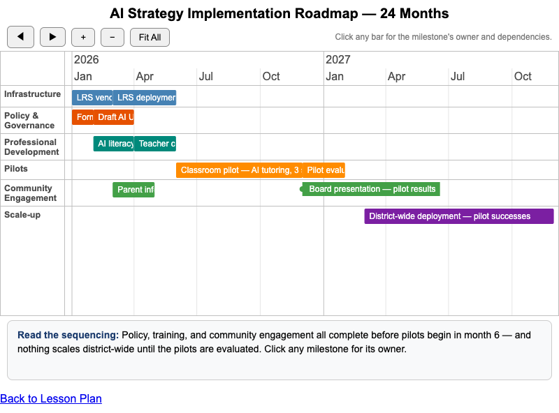

    Interactive vis-timeline roadmap for a phased AI strategy implementation showing dependencies, owners, and sequencing logic.

-   **[AI SWOT Analysis](./shared/swot/index.md)**

    

    Interactive SWOT analysis diagram for AI strategy development with hover descriptions.

-   **[AI Task Horizons](./shared/ai-task-horizons/index.md)**

    

    Interactive visualization showing how long AI models can work on tasks based on METR research.

-   **[AI Timeline](./shared/timeline/index.md)**

    

    Interactive timeline showing over 100 key events in Deep Learning history from 1935 to present.

-   **[Anatomy of an AI Agent](./ai-agent-anatomy/index.md)**

    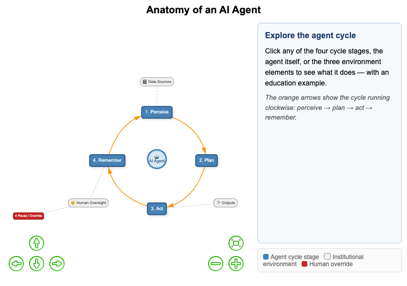

    Interactive vis-network diagram showing the core components of an AI agent and how they connect.

-   **[Anatomy of an Intelligent Textbook](./intelligent-textbook-stack/index.md)**

    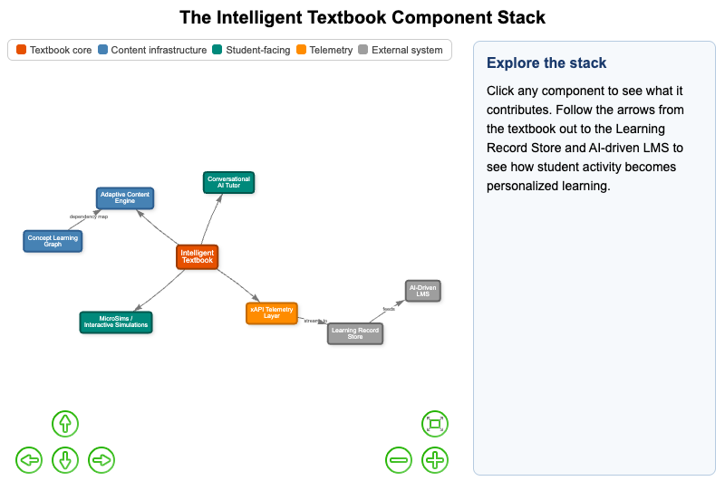

    Interactive vis-network diagram of the components of an intelligent textbook and how they work together to personalize learning.

-   **[Autoregressive](./shared/autoregressive/index.md)**

    

    Interactive simulation showing how language models predict the next token using neural networks.

-   **[Bloom's Taxonomy](./shared/blooms-taxonomy/index.md)**

    

    Infographic with infobox hovers showing layers of Bloom's Taxonomy.

-   **[Book Generation Workflow](./shared/book-gen-workflow/index.md)**

    

    Interactive infographic showing the workflow for generating intelligent textbooks.

-   **[Book Levels](./shared/book-levels/index.md)**

    

    Interactive visualization of five levels of intelligent textbooks from static to AI-driven.

-   **[Build vs. Buy Decision Framework](./build-vs-buy-framework/index.md)**

    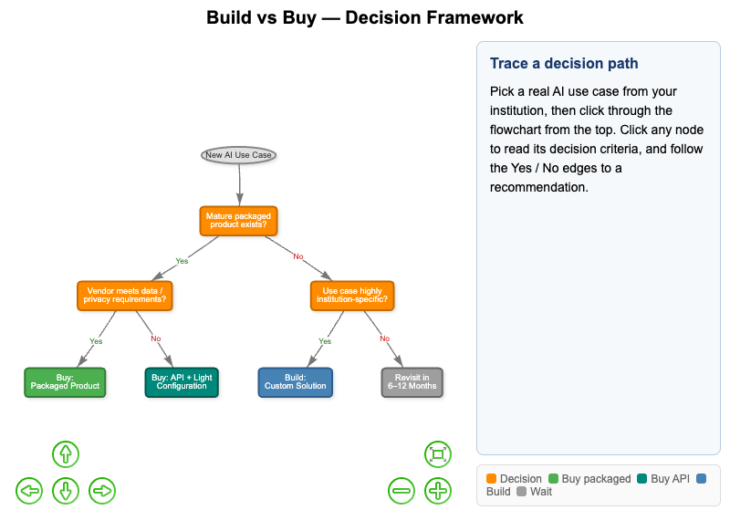

    Interactive vis-network decision tree for tracing an AI use case through the build vs. buy framework to a justified recommendation.

-   **[Center of Excellence Organizational Structure](./coe-org-chart/index.md)**

    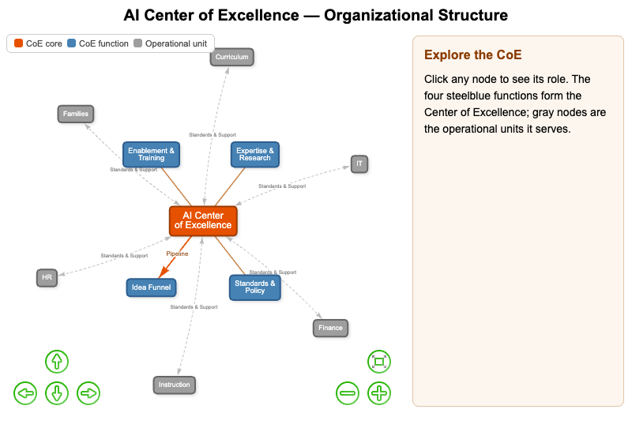

    Interactive vis-network org chart of an AI Center of Excellence showing the role of each function and how it relates to the broader institution.

-   **[CLD Viewer](./shared/cld-viewer/index.md)**

    

    A generic vis-network viewer for causal loop diagrams (CLDs). Loads any CLD JSON file in the systems-thinking schema.

-   **[Eight AI Forces](./shared/eight-ai-forces/index.md)**

    

    Interactive infographic showing the four reinforcing and four balancing loops that determine whether AI capability runs away or stays in oligopoly.

-   **[Exponential Growth Explorer](./exponential-growth-explorer/index.md)**

    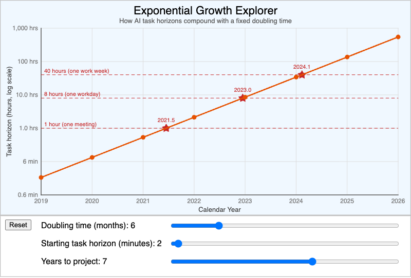

    Interactive p5.js explorer with sliders for doubling time and starting value to build intuition for exponential growth over 2-10 year planning horizons.

-   **[Five Levels of Textbooks Progression](./five-levels-textbooks/index.md)**

    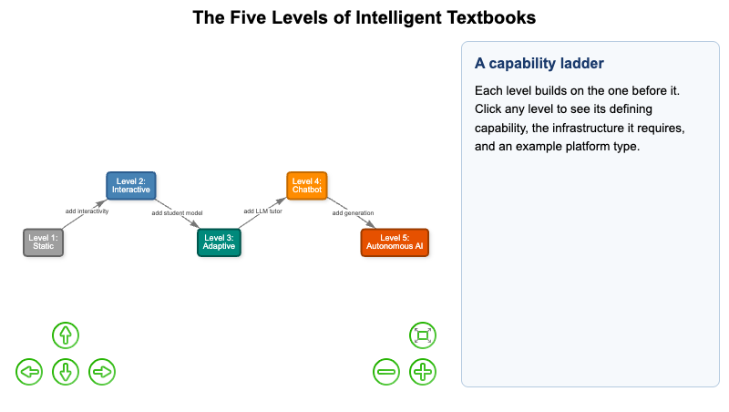

    Interactive vis-network diagram of the five levels of textbooks, from static print to AI-driven adaptive, with the defining capability of each level.

-   **[Four AI Futures](./shared/four-futures/index.md)**

    

    Interactive chart showing four possible scenarios for AI development growth patterns.

-   **[Gap Analysis — Current State to Target State](./gap-analysis-diagram/index.md)**

    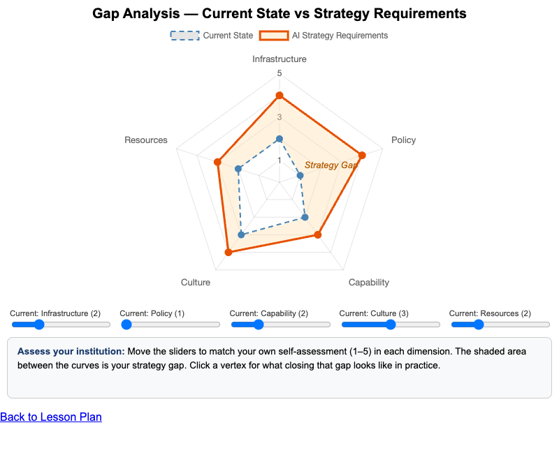

    Interactive Chart.js gap analysis comparing an institution's current capability to AI strategy requirements across key dimensions.

-   **[GenAI Idea Funnel](./shared/idea-funnel/index.md)**

    

    An interactive infographic showing the steps in managing a GenAI Center of Excellence.

-   **[How Retrieval-Augmented Generation Works](./rag-architecture-diagram/index.md)**

    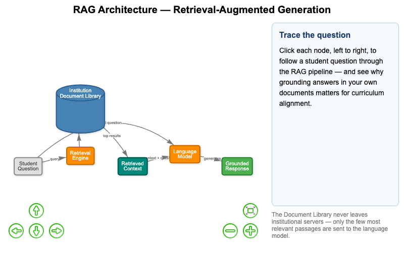

    Interactive vis-network diagram tracing a student question through a retrieval-augmented generation system and why private document grounding matters.

-   **[Interactive Idea Scoring Rubric](./idea-scoring-rubric/index.md)**

    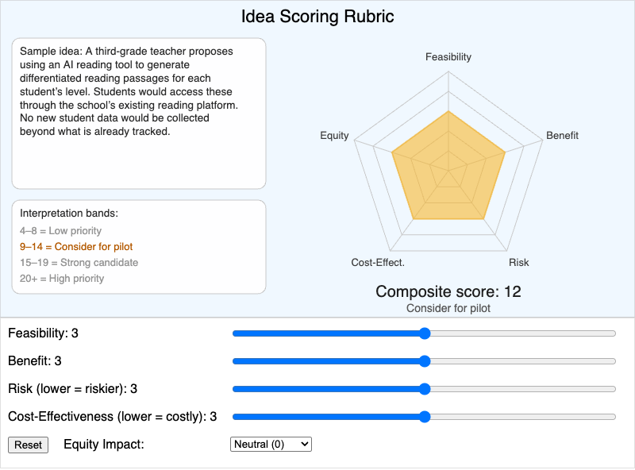

    Interactive p5.js rubric for scoring GenAI project ideas across five dimensions and calculating a composite score.

-   **[Interactive Risk Register](./risk-register-matrix/index.md)**

    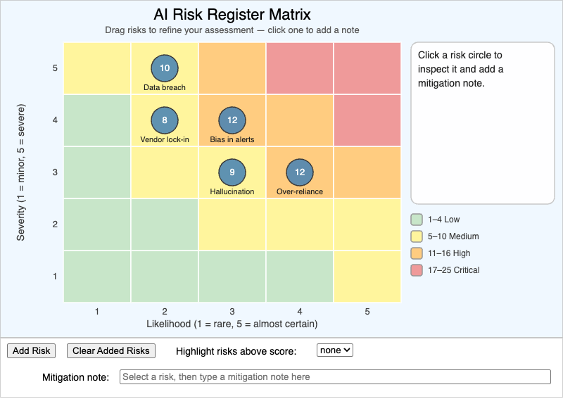

    Interactive p5.js risk register for plotting institutional AI risks on a likelihood-impact matrix and spotting which need urgent mitigation.

-   **[Learning Graph Taxonomy Structure](./learning-graph-taxonomy-structure/index.md)**

    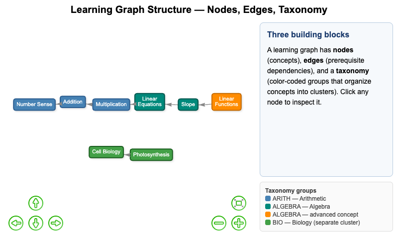

    Interactive vis-network diagram of learning graph structure — nodes, edges, and taxonomy — showing how taxonomy groups organize concept clusters.

-   **[Learning Graph Viewer](./graph-viewer/index.md)**

    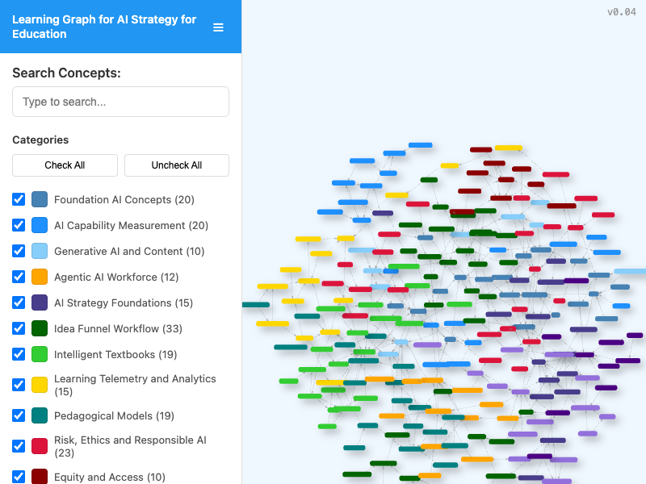

    Interactive vis-network viewer for exploring the course learning graph with concept search, category filtering, pan/zoom navigation, and live statistics.

-   **[LM Arena Timeline](./shared/lm-arena-timeline/index.md)**

    

    Interactive visualization of LMArena benchmark rankings for AI models.

-   **[MMLU Timeline](./shared/mmlu-timeline/index.md)**

    

    Interactive visualization showing AI model progress on the MMLU benchmark.

-   **[Moore's Law](./shared/moores-law/index.md)**

    

    Interactive infographic showing transistor growth with linear and log scale views.

-   **[Neural Network Learning Pathway](./neural-network-learning-pathway/index.md)**

    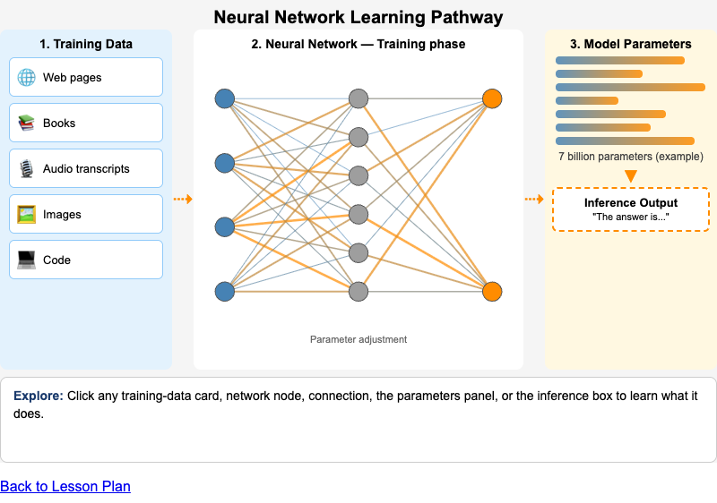

    Interactive diagram showing how training data flows through a neural network to produce model parameters, which are then used for inference.

-   **[Porter's Five Forces](./shared/porters-five-forces/index.md)**

    

    Interactive visualization of Porter's Five Forces competitive analysis framework.

-   **[Portfolio Balance — The Quick Win / Strategic Bet Matrix](./portfolio-balance-matrix/index.md)**

    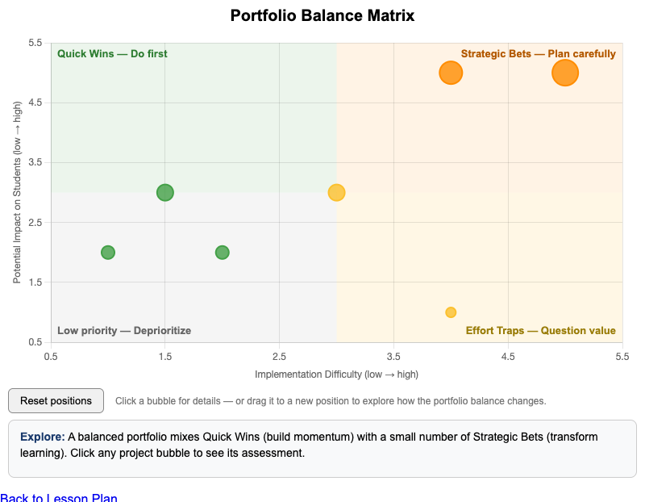

    Interactive Chart.js matrix for positioning candidate AI projects across the quick-win / strategic-bet quadrants and judging portfolio balance.

-   **[Power Wall](./shared/power-wall/index.md)**

    

    Interactive visualization showing CPU clock speed evolution and the Power Wall phenomenon.

-   **[Projecting AI](./shared/projecting-ai/index.md)**

    

    Interactive visualization showing exponential growth of AI task completion capabilities from 2019 to 2030.

-   **[Public vs. Private Knowledge Boundary](./public-private-knowledge-boundary/index.md)**

    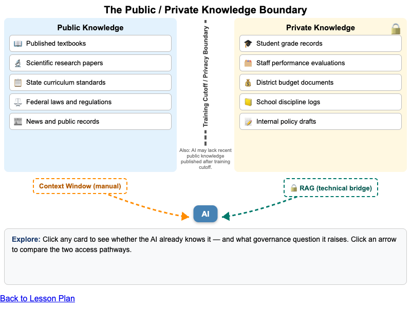

    Interactive vis-network diagram of the boundary between public LLM knowledge and private institutional knowledge, and how RAG bridges the two.

-   **[Sample Concept Learning Graph — Fractions](./concept-learning-graph-fractions/index.md)**

    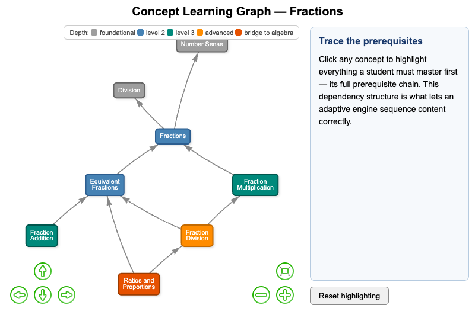

    Interactive vis-network learning graph for fractions showing prerequisite dependencies and why concept ordering matters for adaptive content sequencing.

-   **[Sources of Algorithmic Bias in Education AI](./algorithmic-bias-sources/index.md)**

    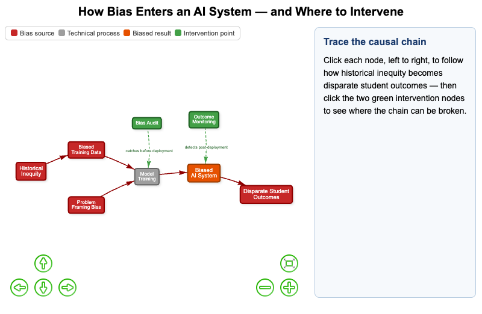

    Interactive vis-network diagram tracing how historical bias enters AI training data, propagates into biased decisions, and where interventions can break the chain.

-   **[Stakeholder Alignment Map](./stakeholder-alignment-map/index.md)**

    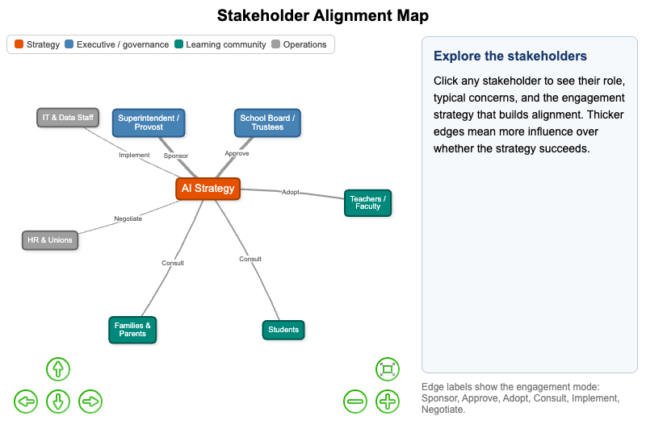

    Interactive vis-network map of stakeholder groups in AI strategy adoption showing each group's role, typical concerns, and engagement strategies.

-   **[SWOT Analysis Framework](./swot-analysis-builder/index.md)**

    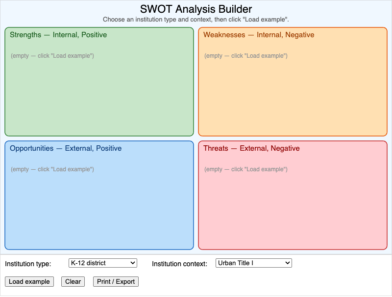

    Interactive p5.js SWOT builder for generating an institution-specific analysis of strengths, weaknesses, opportunities, and threats.

-   **[Technology Adoption Curve](./shared/technology-adoption/index.md)**

    

    An interactive infographic visualizing the Technology Adoption Lifecycle Curve.

-   **[Technology Hype Cycle](./shared/hype-cycle/index.md)**

    

    Interactive visualization of the Gartner Technology Hype Cycle phases.

-   **[The Adoption vs. Capability Gap](./adoption-capability-gap-chart/index.md)**

    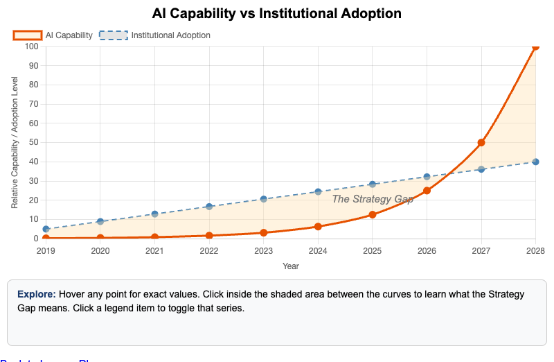

    Interactive Chart.js chart showing the widening gap between accelerating AI capability and slower institutional adoption, and why deliberate strategy is needed to close it.

-   **[The Digital Divide in Education AI Access](./digital-divide-access-chart/index.md)**

    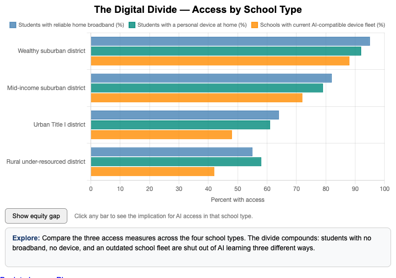

    Interactive Chart.js chart of the dimensions of the digital divide in education AI access and the student populations most affected.

-   **[The Idea Funnel — Six Stages](./idea-funnel-stages/index.md)**

    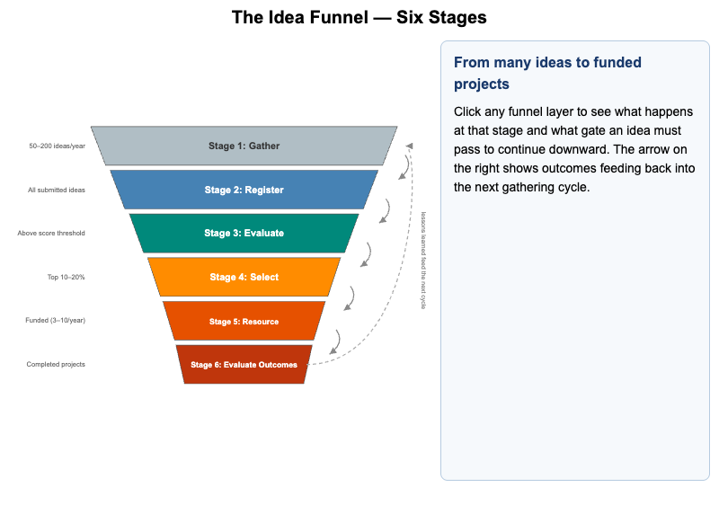

    Interactive vis-network diagram tracing an idea through the six stages of the GenAI idea funnel and what happens at each gate.

-   **[The Institutional Agent Workforce](./agent-workforce-diagram/index.md)**

    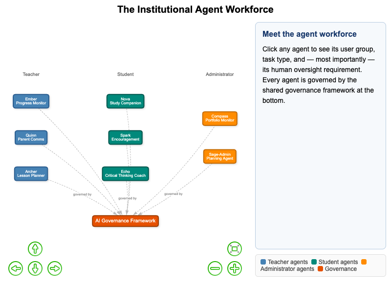

    Interactive vis-network diagram of an institutional AI agent workforce showing each agent's user group, task type, and human oversight requirements.

-   **[The Learning Data Pipeline — From Textbook to Personalized Plan](./learning-data-pipeline/index.md)**

    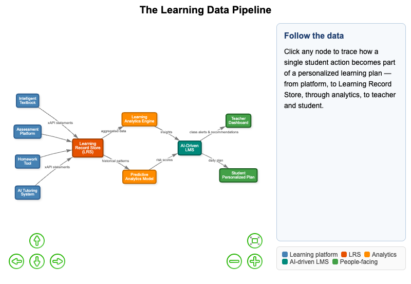

    Interactive vis-network diagram tracing data from a student's learning activity through xAPI and LRS aggregation to a personalized learning plan.

-   **[The METR Task Horizon Timeline](./metr-task-horizon-timeline/index.md)**

    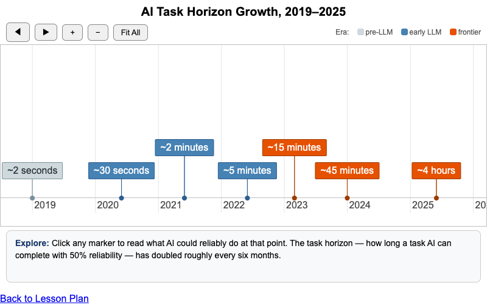

    Interactive vis-timeline of METR task-horizon data points showing the pace and pattern of AI capability growth.

-   **[The xAPI Statement Structure](./xapi-statement-anatomy/index.md)**

    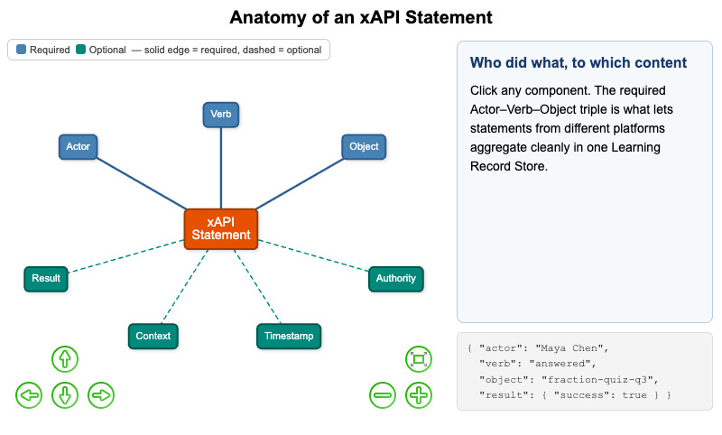

    Interactive vis-network diagram of xAPI statement structure showing its required and optional components and how Actor-Verb-Object enables data aggregation.

-   **[Tokenizer](./shared/tokenizer/index.md)**

    

    Interactive visualization demonstrating how text is tokenized for language model processing.

-   **[Traditional vs. Alpha School Day Structure](./school-day-comparison-timeline/index.md)**

    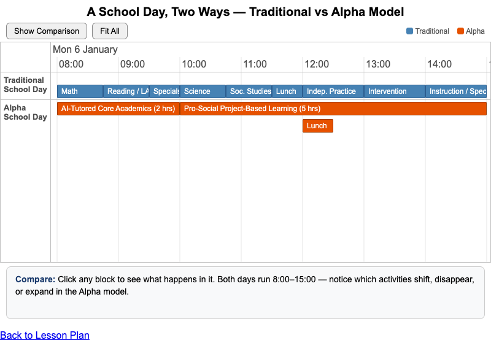

    Interactive vis-timeline comparing time allocation in a traditional school day to the Alpha school model, showing which activities shift, disappear, or expand.

-   **[Winner-Takes-All CLD](./shared/winner-takes-all-cld/index.md)**

    An interactive vis-network causal loop diagram of the reinforcing and balancing loops that determine whether AI tips into a single dominant player.

